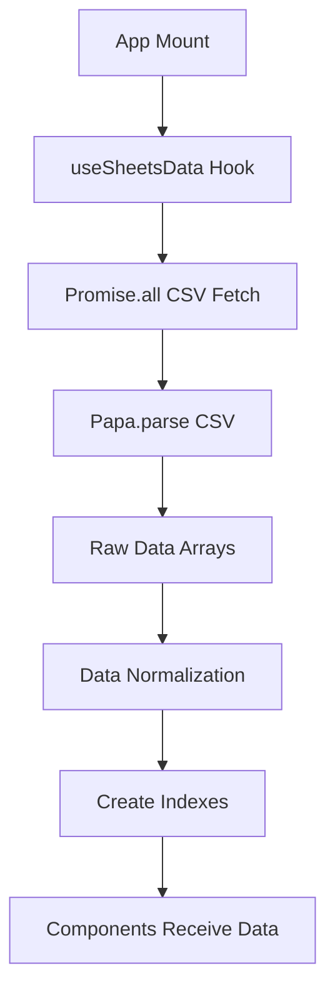
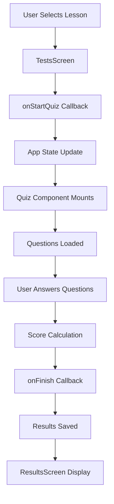
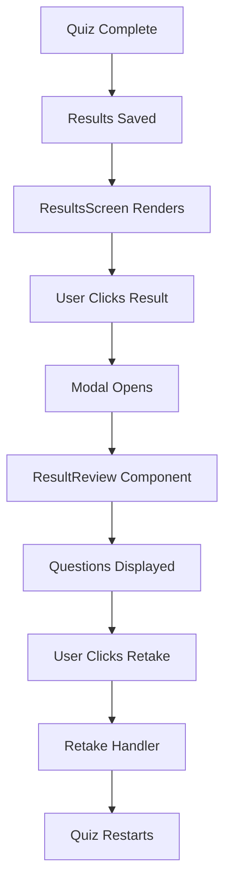
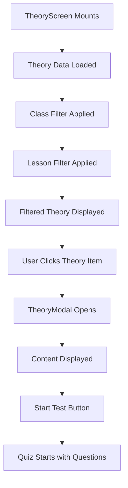

# Data Flow Documentation

## 🔄 Overview

This document describes how data flows through the Math Quiz Application, from CSV sources to user interface components.

## 📊 Data Sources

### Google Sheets Structure
```
Google Sheets
├── classes.csv      # Class information (id, name)
├── subjects.csv     # Subject information (id, name)  
├── lessons.csv      # Lesson information (id, class_id, title)
├── questions.csv    # Quiz questions (id, lesson_id, text, A, B, C, D, correct, explanation)
└── theory.csv       # Theory content (id, class_id, lesson_id, title, content)
```

### CSV Format Examples

**classes.csv**
```csv
id,name
1,1 клас
2,2 клас
3,3 клас
```

**questions.csv**
```csv
id,lesson_id,text,A,B,C,D,correct,explanation
Q1001,lesson-1,"Кое е по-голямо? 3,45 или 3,405",3,45,3,405,Равни са,Не може да се определи,A,"При сравнение изравняваме знаците: 3,450 > 3,405"
```

## 🚀 Data Pipeline

### 1. Initial Data Fetching



**Step-by-step process:**

1. **App Mount**: `MathApp` component mounts and calls `useSheetsData()`
2. **Hook Initialization**: Hook sets `loading: true` and `error: null`
3. **Parallel Fetching**: All CSV files are fetched simultaneously using `Promise.all`
4. **CSV Parsing**: Each CSV is parsed using Papa.parse with error handling
5. **Data Transformation**: Raw data is normalized and standardized
6. **Index Creation**: Efficient lookup indexes are created
7. **State Update**: Hook updates state with normalized data and indexes

### 2. Data Normalization Process

```javascript
// Before normalization (raw CSV data)
{
  id: " 1 ",           // Whitespace, string
  class_id: "2",       // String
  title: "  Math  ",   // Extra whitespace
  A: "Answer A",       // Inconsistent casing
  correct: "A"         // Correct answer
}

// After normalization
{
  id: "1",             // Trimmed, string
  class_id: "2",       // String
  title: "Math",       // Trimmed
  A: "Answer A",       // Preserved
  correct: "A"         // Preserved
}
```

**Normalization rules:**
- All IDs converted to strings and trimmed
- Text fields trimmed of whitespace
- Consistent property naming (`class_id` + `classId` for compatibility)
- Safe defaults for missing values

### 3. Index Creation

```javascript
// questionsByLessonId index
{
  "lesson-1": [
    { id: "q1", lesson_id: "lesson-1", text: "Question 1", ... },
    { id: "q2", lesson_id: "lesson-1", text: "Question 2", ... }
  ],
  "lesson-2": [
    { id: "q3", lesson_id: "lesson-2", text: "Question 3", ... }
  ]
}

// questionsById index
{
  "q1": { id: "q1", lesson_id: "lesson-1", text: "Question 1", ... },
  "q2": { id: "q2", lesson_id: "lesson-1", text: "Question 2", ... },
  "q3": { id: "q3", lesson_id: "lesson-2", text: "Question 3", ... }
}
```

## 🔄 Component Data Flow

### 1. Quiz Flow



**Data transformations:**

1. **Lesson Selection**: User clicks lesson → `handleStartQuiz(lesson, questions)`
2. **Quiz Start**: App updates `activeQuiz` state → Quiz component mounts
3. **Question Display**: Questions passed as props → Quiz renders questions
4. **Answer Collection**: User answers stored in local state
5. **Score Calculation**: Final score computed from answers
6. **Results Saving**: Complete result object saved to localStorage

### 2. Results Flow



**Data flow details:**

1. **Results Storage**: Results include `questions` array for retaking
2. **Results Display**: ResultsScreen maps over saved results
3. **Modal Opening**: Click handler sets `activeResult` state
4. **Question Review**: ResultReview receives result with questions
5. **Retake Logic**: Retake button triggers `onRetakeTest` callback

### 3. Theory Flow



## 📊 Data State Management

### 1. Global State (App.jsx)

```javascript
const [activeQuiz, setActiveQuiz] = useState(null);
const [lastQuiz, setLastQuiz] = useState(null);
const [results, setResults] = useState([]);
const [route, setRoute] = useState("home");
```

**State updates:**
- `activeQuiz`: Set when starting a quiz, cleared when quiz completes
- `lastQuiz`: Updated after each quiz completion for retake functionality
- `results`: Array of all quiz results, persisted in localStorage
- `route`: Navigation state between different screens

### 2. Local State (Components)

```javascript
// ResultsScreen
const [activeResult, setActiveResult] = useState(null);
const [isModalOpen, setIsModalOpen] = useState(false);

// TheoryScreen  
const [activeClassId, setActiveClassId] = useState(null);
const [activeLessonId, setActiveLessonId] = useState('');
const [searchQuery, setSearchQuery] = useState('');
```

### 3. Persistent State (localStorage)

```javascript
// Profile data
localStorage.setItem('quiz-profile', JSON.stringify(profile));

// Quiz results
localStorage.setItem('quiz-results', JSON.stringify(results));

// User settings
localStorage.setItem('quiz-settings', JSON.stringify(settings));
```

## 🔧 Data Validation & Error Handling

### 1. Input Validation

```javascript
// Safe ID handling
const normalizeId = (id) => id ? String(id).trim() : '';

// Safe text handling
const safeText = (text) => text?.trim() || '';

// Array validation
const safeArray = (arr) => Array.isArray(arr) ? arr : [];
```

### 2. Error Boundaries

```javascript
// CSV parsing errors
if (res.errors && res.errors.length > 0) {
  reject(new Error(`CSV parsing failed: ${res.errors[0].message}`));
}

// Network errors
if (!res.data || res.data.length === 0) {
  reject(new Error('CSV returned no data'));
}
```

### 3. Fallback Data

```javascript
// Default values for missing data
const lesson = {
  id: result.lesson?.id || result.lesson?.lesson_id || '',
  title: result.lesson?.title || result.lesson?.name || 'Урок',
  name: result.lesson?.name || result.lesson?.title || 'Урок'
};
```

## 🚀 Performance Optimizations

### 1. Memoization

```javascript
// Stable indexes
const indexes = useMemo(() => {
  // Create indexes only when data changes
}, [normalizedData]);

// Filtered data
const filteredTheory = useMemo(() => {
  // Apply filters only when dependencies change
}, [theory, activeClassId, activeLessonId, debouncedSearchQuery]);
```

### 2. Efficient Lookups

```javascript
// O(1) lookup instead of O(n) search
const questions = questionsByLessonId[lessonId] || [];

// Instead of
const questions = questions.filter(q => q.lesson_id === lessonId);
```

### 3. Debounced Search

```javascript
// Prevent excessive filtering on every keystroke
useEffect(() => {
  const timer = setTimeout(() => setDebouncedSearchQuery(searchQuery), 250);
  return () => clearTimeout(timer);
}, [searchQuery]);
```

## 🔍 Debugging & Monitoring

### 1. Console Logging

```javascript
// Targeted logging with prefixes
console.log('[useSheetsData] Data loaded:', data);
console.log('[ResultsScreen] Retaking test for lesson:', lessonId);
console.error('[fetchCSV] Parsing errors for URL:', url, errors);
```

### 2. Data Validation Checks

```javascript
// Verify data integrity
console.log('Data validation:', {
  hasQuestions: questions.length > 0,
  hasLessons: lessons.length > 0,
  hasClasses: classes.length > 0,
  totalQuestions: questions.length
});
```

### 3. Performance Monitoring

```javascript
// Measure data processing time
const startTime = performance.now();
// ... data processing ...
const endTime = performance.now();
console.log(`Data processing took ${endTime - startTime}ms`);
```

## 🧪 Testing Data Flow

### 1. Unit Tests

```javascript
// Test data normalization
test('normalizeId trims whitespace', () => {
  expect(normalizeId(' 123 ')).toBe('123');
  expect(normalizeId('')).toBe('');
  expect(normalizeId(null)).toBe('');
});

// Test index creation
test('questionsByLessonId creates correct structure', () => {
  const questions = [{ id: 'q1', lesson_id: 'l1' }, { id: 'q2', lesson_id: 'l1' }];
  const index = createQuestionsByLessonIdIndex(questions);
  expect(index['l1']).toHaveLength(2);
});
```

### 2. Integration Tests

```javascript
// Test complete data flow
test('quiz completion saves results with questions', async () => {
  // Start quiz
  // Answer questions
  // Complete quiz
  // Verify results saved with questions array
  // Verify retake functionality works
});
```

## 🔮 Future Improvements

### 1. Data Caching

```javascript
// Implement service worker for offline support
// Cache CSV data for faster subsequent loads
// Implement data versioning for updates
```

### 2. Real-time Updates

```javascript
// WebSocket connection for live data updates
// Polling mechanism for data freshness
// Optimistic updates for better UX
```

### 3. Advanced Indexing

```javascript
// Full-text search indexes
// Fuzzy matching for search queries
// Predictive data loading
```

---

This data flow architecture ensures efficient, reliable, and maintainable data handling throughout the application while providing excellent user experience and performance.
